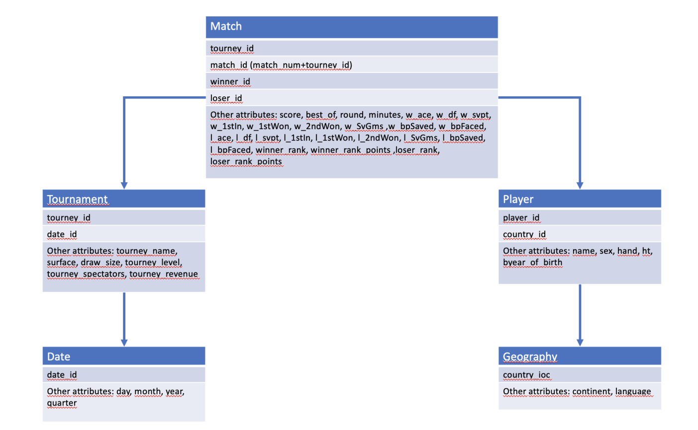

# Lab_DS_tennisDF

#  Introduction Part 1
In Part 1 of the project you are required to create and populate a database starting from .csv
les and perform dierent operations on it. In the following you can nd a set of incremental
assignments, each one with a brief description of what you are required to produce and what
tools you can use for the task.

##  Build the datawarehouse
tennis.csv contains the main body of data: a fact table with tennis match data. For each
match we have information about the tournament, the players involved (winner and loser)
and several other metrics.
Files male players.csv and female players.csv contain the list of male players and
female players respectively, while geography.csv contain a list of IOC codes with country
names and continents.
In these four les you will nd all the attributes to reproduce the schema shown in 1.
The le tennis.csv will have to be split appropriately and combined with the other les to
achieve this goal.
The goal of the following assignments is to build the schema and deploy it on server
lds.di.unipi.it. Beware that, just as in real-life scenario, les may contain missing values
and/or slight mistakes.

### Assignment 0
Create the database schema in Figure 1 using SQL Server Management Studio in
server lds.di.unipi.it. The name of the database must be GroupIDHWMart (exam-
ple: Group01HWMart).

### Assignment 1
Write a python program that splits the content of tennis.csv into four separate
tables: match, tournament, date and player. Use the les male players.csv and
female plauyers.csv to create the attribute "sex" for the player table. The use
of the pandas library is forbidden for this assingment.

### Assignment 2
Write a Python program that populates the database GroupIDHWMart with the
various tables from the .csv les, establishing schema relations as necessary.

# Introduction Part 2 (SISS Part)
In Part 2 of the project you are required to solve some problems on the database you
created in Part 1. Solve the exercises using Sequel Server Integration Services (SSIS) with
computation on client side (i.e., do not use any sql command in the nodes, only standard
SSIS nodes). Each group has to solve only three assignments. Look at the section with your
groupid to find what assignments you need to do. Deliver your project with all the required
packages in a single .zip folder, named LDS Part2 groupid.zip.

### Assignment 0
For every year, the tournaments ordered by spectators

### Assignment 1
For any given player, his or her ”nemesis” is the player against whom he or she
lost most matches. List every player with the respective nemesis and the number
of matches lost.

### Assignment 2
For each year, the name of the tournament with more matches played.

# Introduction Part 3 (SASS Part + MDX Queries + PowerBI dashboard)

In Part 3 of the project you are required to answer some business questions on a datacube
that you will create on the database you prepared. Document how you build your datacube in
your report and solve the business questions using MultiDimensional eXpressions (MDX) in
SQL management studio. Each group has to solve only the assignments on the corresponding
group number page. Look at the section with your groupid to find which assignments you
need to do. 

### Assignment 0
Build a datacube from the data of the tables in your database, defining the appropriate hierarchies for time and geography. Use the rank and rank points of the
winner and loser as measure.

### Assignment 1 - MDX
Show the total winners for each country and the grand total with respect to the
continent

### Assignment 2 - MDX
Show the total winner rank points for each year and the running yearly winner rank
points for European players.

### Assignment 3 - MDX
Show the ratio between the total winner rank points of each year w.r.t the previous
year

### Assignment 4 - PowerBI
Create a dashboard that shows the geographical distribution of winner rank points
and loser rank points

### Assignment 5 - Power BI
Create a plot/dashboard of your choosing, that you deem interesting w.r.t. the
data available in your cube
